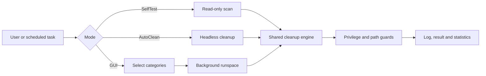

# OpenRelax PC Care

[](https://github.com/mehmeterendereli/openrelax/actions/workflows/verify.yml)

A portable Windows maintenance utility built with **PowerShell and Windows Forms**. It runs from source, requires no installer, and keeps its cleanup targets and safety boundaries visible in one inspectable script.

**Current status:** v2.0 focused utility · Windows only · MIT licensed · automated parser/self-test verification · no signed binary release yet

> OpenRelax is not a registry “optimizer” and it does not promise permanent RAM gains. It cleans regenerable files, trims eligible process working sets, and reports what happened.

## What you can inspect

| Area | Concrete implementation |
|---|---|
| **Cleanup engine** | Explicit path lists for temporary files, browser/application caches, GPU caches, Windows Error Reporting, update cache and installer leftovers |
| **Safety model** | Administrator-only targets are marked and skipped without elevation; locked files are skipped; sensitive profile data and diagnostic folders are excluded |
| **Execution** | Cleanup, scanning and disk analysis run in background PowerShell runspaces so the WinForms UI remains responsive |
| **Operating modes** | Interactive GUI, tray/minimized startup, scheduled headless cleanup and read-only `-SelfTest` |
| **Verification** | Windows CI parses the complete script, runs the real `-SelfTest` path and proves that settings and AutoClean log state remain unchanged |
| **Persistence** | Settings and aggregate usage statistics are stored in `%APPDATA%\OpenRelax\settings.json` |

## Execution map



The GUI and headless modes use the same serialized engine functions rather than maintaining separate cleanup implementations.

## Quick start

### Open the interface

Clone or download the repository, then run:

```bat
launch.bat
```

The launcher starts `openrelax.ps1` and opens the Windows Forms interface.

### Inspect without deleting anything

Run the read-only engine scan first:

```powershell
powershell -NoProfile -ExecutionPolicy Bypass -File .\openrelax.ps1 -SelfTest
```

`-SelfTest` reports the selected targets and what is detectable on the current machine. It is a practical smoke check, **not** a complete unit-test suite.

### Other modes

```powershell
# Start hidden in the system tray
powershell -NoProfile -ExecutionPolicy Bypass -File .\openrelax.ps1 -StartMinimized

# Run cleanup headlessly with saved settings
powershell -NoProfile -ExecutionPolicy Bypass -File .\openrelax.ps1 -AutoClean
```

`-AutoClean` can delete files according to the saved category settings. Use `-SelfTest` first when evaluating the tool on a new system.

## Automated verification

Every push and pull request targeting `main` runs on a GitHub-hosted Windows machine. The verification job:

1. Parses the complete `openrelax.ps1` file with PowerShell's language parser and fails on any syntax error.
2. Starts the real application in a separate Windows PowerShell process with `-SelfTest`.
3. Requires a zero exit code, the versioned self-test banner and the final `Self-test OK` marker.
4. Fingerprints `%APPDATA%\OpenRelax\settings.json` and `autoclean.log` before and after execution, failing if the supposedly read-only path creates, removes or modifies either file.

Run the same entrypoint locally:

```powershell
powershell -NoProfile -ExecutionPolicy Bypass -File .\tests\verify.ps1
```

This proves that the checked-in script parses, its non-destructive scan path executes successfully on Windows and its persistent settings/log state stays unchanged. It does **not** replace isolated unit tests for each cleanup function or destructive-mode testing on every Windows configuration.

## Safety contract

OpenRelax deliberately avoids broad “delete everything” behaviour:

- **Windows Prefetch is not cleaned.** Windows manages it, and removing it can make application launches slower.
- **`Windows\Logs` and `Windows\Panther` are not cleaned.** They may be needed for diagnostics and upgrade rollback.
- **Browser bookmarks, history and profile data are not targeted.** Only known regenerable cache directories are included.
- **Windows Update cleanup is disabled by default** and requires administrator rights. When enabled, the related services are stopped before cleanup and restarted afterward.
- **Administrator-only paths are skipped** when OpenRelax is not elevated.
- **Locked or in-use files are skipped** instead of being forced or scheduled for deletion.
- **Critical Windows processes are excluded** from working-set trimming.
- **RAM reclamation is temporary by nature.** Applications can request those pages again as their workload continues.

The source remains the final authority. Review `Get-JunkCategories`, `Remove-JunkPaths` and `Invoke-RamTrim` in `openrelax.ps1` before deploying it in a managed environment.

## Features

- One-click maintenance for selected categories
- User and system temporary-file scanning
- Chrome, Edge, Brave, Opera/Opera GX and Firefox cache cleanup across detected profiles
- Discord and GPU shader-cache cleanup
- Optional Windows Error Reporting, Windows Update and GPU-installer cleanup
- Recycle Bin cleanup
- Native Windows API working-set trimming with a critical-process exclusion list
- Automatic RAM threshold with five-minute cooldown and hysteresis
- System tray operation and start-with-Windows option
- Weekly scheduled cleanup using saved settings
- Read-only largest-folder analysis for the user profile
- Aggregate cleaned-space and maintenance-run statistics
- Turkish and English interface strings
- Live CPU, RAM and uptime display

## Repository map

```text
openrelax.ps1                  Application, UI, engine and operating modes
launch.bat                     No-install Windows launcher
tests/verify.ps1               Parser + real read-only self-test entrypoint
.github/workflows/verify.yml   Windows CI definition
README.md                      Behaviour, safety contract and usage
PLAN.md                        Original implementation plan and design notes
LICENSE                        MIT license text
```

Keeping the application in one script makes it easy to audit and copy. It also creates a real maintenance limit: the project is not yet split into independently testable modules.

## Current limits

- Windows and Windows Forms only
- Distributed as source; there is currently no signed installer or signed executable release
- Windows CI covers parser correctness and the real read-only self-test, but there is no isolated unit-test suite yet
- The application is a single large PowerShell script, which keeps deployment simple but reduces modular testability
- Cleanup results vary by permissions, active applications and machine configuration
- Working-set trimming should not be interpreted as a permanent performance or memory-capacity increase

These limits are stated intentionally so the repository shows what exists now—not what a future release might become.

## Türkçe özet

OpenRelax; geçici dosyaları ve bilinen uygulama önbelleklerini temizleyen, uygun süreçlerin kullanılmayan çalışma setlerini daraltan ve Windows sistem tepsisinde çalışabilen açık kaynak bir bakım aracıdır.

İlk denemede hiçbir dosya silmeden kontrol etmek için:

```powershell
powershell -NoProfile -ExecutionPolicy Bypass -File .\openrelax.ps1 -SelfTest
```

Aynı parser ve salt-okunur uygulama kontrolünü yerelde çalıştırmak için:

```powershell
powershell -NoProfile -ExecutionPolicy Bypass -File .\tests\verify.ps1
```

CI, `SelfTest` çalışırken ayar dosyası ile AutoClean günlüğünün oluşturulmadığını, silinmediğini veya değiştirilmediğini de doğrular.

Araç; Prefetch klasörünü, Windows tanılama günlüklerini, tarayıcı geçmişini, yer imlerini ve kullanıcı profil verilerini temizlemez. Windows Update temizliği varsayılan olarak kapalıdır ve yalnızca yönetici yetkisiyle çalışır.

## License

Released under the [MIT License](LICENSE).
