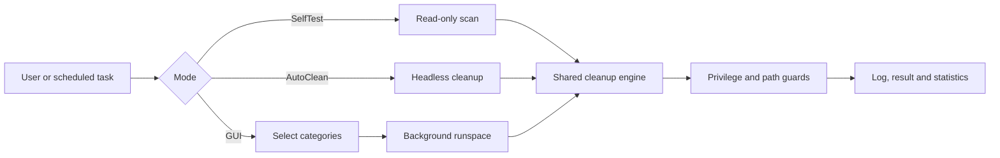

# OpenRelax PC Care

[](https://github.com/mehmeterendereli/openrelax/actions/workflows/verify.yml)

[Open-source portfolio](https://www.mehmeterendereli.com/en/open-source) · [Maintainer profile](https://github.com/mehmeterendereli)

A portable Windows maintenance utility built with **PowerShell and Windows Forms**. It runs from source, requires no installer, and keeps its cleanup targets and safety boundaries visible in one inspectable script.

**Current status:** source version 2.1 LTS ([changelog](CHANGELOG.md)) · focused Windows utility · MIT licensed · automated parser/self-test verification · local stress tests · no signed binary release

> OpenRelax is not a registry “optimizer” and it does not promise permanent RAM gains. It cleans regenerable files, trims eligible process working sets, and reports what happened.

## What you can inspect

| Area | Concrete implementation |
|---|---|
| **Cleanup engine** | Explicit path lists for temporary files, browser/application caches, GPU caches, Windows Error Reporting, update cache and installer leftovers |
| **Safety model** | Administrator-only targets are marked and skipped without elevation; locked files are skipped; sensitive profile data and diagnostic folders are excluded |
| **Execution** | Cleanup, scanning and disk analysis run in background PowerShell runspaces so the WinForms UI remains responsive |
| **Operating modes** | Interactive GUI, tray/minimized startup, scheduled headless cleanup and read-only `-SelfTest` |
| **CPU spike trap** | `fotokapan.ps1` runs as a SYSTEM scheduled task and records which processes (or drivers) caused each CPU spike; the **Fotokapan** tab shows the top culprits and recent spikes |
| **Verification** | Windows CI parses the complete script, runs the real `-SelfTest` path and proves that settings and AutoClean log state remain unchanged; local stress tests cover the engine, the spike trap and the GUI |
| **Persistence** | Settings and aggregate usage statistics are stored in `%APPDATA%\OpenRelax\settings.json` |

## Execution map


```mermaid
flowchart LR
    USER[User or scheduled task] --> MODE{Mode}
    MODE -->|GUI| SELECT[Select categories]
    MODE -->|SelfTest| SCAN[Read-only scan]
    MODE -->|AutoClean| CLEAN[Headless cleanup]
    SELECT --> WORKER[Background runspace]
    SCAN --> ENGINE[Shared cleanup engine]
    CLEAN --> ENGINE
    WORKER --> ENGINE
    ENGINE --> GUARDS[Privilege and path guards]
    GUARDS --> RESULT[Log, result and statistics]
```

The GUI and headless modes use the same serialized engine functions rather than maintaining separate cleanup implementations.

## Quick start

### Open the interface

Clone or download the repository, then run:

```bat
launch.bat
```

The launcher starts `openrelax.ps1` and opens the Windows Forms interface.

### Inspect without deleting anything

Run the read-only engine scan first:

```powershell
powershell -NoProfile -ExecutionPolicy Bypass -File .\openrelax.ps1 -SelfTest
```

`-SelfTest` reports the selected targets and what is detectable on the current machine. It is a practical smoke check, **not** a complete unit-test suite.

### Other modes

```powershell
# Start hidden in the system tray
powershell -NoProfile -ExecutionPolicy Bypass -File .\openrelax.ps1 -StartMinimized

# Run cleanup headlessly with saved settings
powershell -NoProfile -ExecutionPolicy Bypass -File .\openrelax.ps1 -AutoClean
```

`-AutoClean` can delete files according to the saved category settings. Use `-SelfTest` first when evaluating the tool on a new system.

### Run as administrator

Administrator rights are needed only for the admin-only cleanup targets (system temp, Windows Error Reporting, Windows Update cache) and for installing or removing the CPU spike trap. Either right-click `launch.bat` → **Run as administrator**, or use **Settings → Restart as administrator** inside the app.

## Fotokapan (CPU spike trap)

Intermittent 100 % CPU is hard to diagnose: by the time Task Manager is open, the burst is often over, and a starved UI thread cannot sample during it. `fotokapan.ps1` therefore runs outside the GUI as a SYSTEM scheduled task (above-normal priority, no time limit):

- When total CPU stays at or above 85 % for 4 seconds it measures **the burst itself** (per-process CPU from the first hot sample), plus parent processes, command lines (secrets masked), processes started in the last two minutes and CPU time no process accounts for (interrupts/DPCs — drivers).
- If Microsoft Defender is among the top consumers it records whether an on-demand scan is running, or otherwise attaches a 30-second Defender performance report (at most every 6 hours).
- Output lives in `C:\ProgramData\OpenRelax\Fotokapan\`, readable only by SYSTEM, Administrators and the installing user: `fotokapan-YYYY-MM.log` (human-readable), `spikes-YYYY-MM.jsonl` (one JSON record per line — the contract the GUI reads) and `durum.json` (heartbeat, rewritten every minute).

Install, update or remove it from the **Fotokapan** tab (asks for elevation when needed) or from an elevated PowerShell:

```powershell
.\fotokapan.ps1 -Install     # copy to ProgramData, register and start the task
.\fotokapan.ps1 -Uninstall   # remove the task; recorded logs are kept
```

## Automated verification

Every push and pull request targeting `main` runs on a GitHub-hosted Windows machine. The verification job:

1. Parses the complete `openrelax.ps1` file with PowerShell's language parser and fails on any syntax error.
2. Starts the real application in a separate Windows PowerShell process with `-SelfTest`.
3. Requires a zero exit code, the versioned self-test banner and the final `Self-test OK` marker.
4. Exercises the Windows Update service-state contract without deleting files: only services that were running may be stopped, cleanup is blocked after a stop failure, and prior states must be restored.
5. Fingerprints `%APPDATA%\OpenRelax\settings.json` and `autoclean.log` before and after execution, failing if the supposedly read-only path creates, removes or modifies either file.

Run the same entrypoint locally:

```powershell
powershell -NoProfile -ExecutionPolicy Bypass -File .\tests\verify.ps1
```

This proves that the checked-in script parses, its non-destructive scan path executes successfully on Windows, its Windows Update service-state guard behaves deterministically, and its persistent settings/log state stays unchanged. It does **not** replace comprehensive unit tests for every cleanup function or destructive-mode testing on every Windows configuration.

### Stress tests (local)

Three stress tests in `tests/` exercise what CI does not. They are run locally before a release (the GUI test needs an interactive desktop):

| Script | What it proves |
|---|---|
| `tests\engine-stress.ps1` | The real scan/clean engine, in a worker runspace as the GUI uses it, on a 30 000-file synthetic tree with traps — a junction loop, a junction to an outside sentinel, a held-open file, files younger than 24 h, read-only/hidden files, bracket/Turkish names, deep and over-long paths. Nothing outside the tree is touched, progress beats keep coming and memory stays bounded. |
| `tests\fotokapan-stress.ps1` | A private spike-trap instance through a storm of CPU bursts: every burst caught and attributed to the right process, JSONL contract valid, heartbeat refreshed, monitor overhead and handles/memory stable, and the GUI's reader survives damaged lines. Pause an installed trap first (`Stop-ScheduledTask 'OpenRelax Fotokapan'`) to keep the synthetic bursts out of its statistics. |
| `tests\gui-stress.ps1` | Drives the real GUI handlers for N cycles — view switches, language re-apply, background scans, Fotokapan list re-rendering over 300 synthetic spikes — and fails on handler errors or GDI/USER/handle/memory growth; then starts and closes the app repeatedly. Nothing is cleaned and no setting is saved. |

The GUI test uses environment hooks that are inert otherwise: `OPENRELAX_STRESS=<cycles>` with `OPENRELAX_STRESS_REPORT=<file.json>`, `OPENRELAX_SMOKETEST=1|<seconds>` and `OPENRELAX_TRAP_DIR=<folder>`.

## Contributing

See [CONTRIBUTING.md](CONTRIBUTING.md) for the Windows PowerShell 5.1 setup,
change-specific test commands, safety contracts and privacy guidance for bug
reports. Pull requests should name the tests actually run and any Windows
configuration that still needs validation.

## Safety contract

OpenRelax deliberately avoids broad “delete everything” behaviour:

- **Windows Prefetch is not cleaned.** Windows manages it, and removing it can make application launches slower.
- **`Windows\Logs` and `Windows\Panther` are not cleaned.** They may be needed for diagnostics and upgrade rollback.
- **Browser bookmarks, history and profile data are not targeted.** Only known regenerable cache directories are included.
- **Windows Update cleanup is disabled by default** and requires administrator rights. When enabled, the related services are stopped before cleanup and restarted afterward.
- **Administrator-only paths are skipped** when OpenRelax is not elevated.
- **Locked or in-use files are skipped** instead of being forced or scheduled for deletion.
- **Recently changed temp files are kept.** Files in the temp folders that changed within the last 24 hours belong to running applications and are neither counted nor deleted.
- **Junctions are never followed or removed**, so cleaning a folder cannot reach data that a junction points to.
- **Scans are time-budgeted.** A huge temp folder is reported as a lower bound (`≥ X GB`) instead of stalling; background work reports progress, and a worker is abandoned only after 60 seconds without any.
- **Critical Windows processes are excluded** from working-set trimming.
- **RAM reclamation is temporary by nature.** Applications can request those pages again as their workload continues.

The source remains the final authority. Review `Get-JunkCategories`, `Remove-JunkPaths` and `Invoke-RamTrim` in `openrelax.ps1` before deploying it in a managed environment.

## Features

- One-click maintenance for selected categories
- User and system temporary-file scanning
- Chrome, Edge, Brave, Opera/Opera GX and Firefox cache cleanup across detected profiles
- Discord and GPU shader-cache cleanup
- Optional Windows Error Reporting, Windows Update and GPU-installer cleanup
- Recycle Bin cleanup
- Native Windows API working-set trimming with a critical-process exclusion list
- Automatic RAM threshold with five-minute cooldown and hysteresis
- System tray operation and start-with-Windows option
- Weekly scheduled cleanup using saved settings
- Read-only largest-folder analysis for the user profile, with progress
- Fotokapan CPU spike trap with a GUI tab: top culprits of the last 7 days, recent spikes, install/update/remove, open log
- Aggregate cleaned-space and maintenance-run statistics
- Turkish and English interface strings
- Live CPU, RAM and uptime display

## Repository map

```text
openrelax.ps1                  Application, UI, engine and operating modes
fotokapan.ps1                  CPU spike trap (SYSTEM scheduled task)
launch.bat                     No-install Windows launcher
tests/verify.ps1               Parser + real read-only self-test entrypoint (CI)
tests/*-stress.ps1             Engine, spike-trap and GUI stress tests (local)
CHANGELOG.md                   Release notes
CONTRIBUTING.md                Development, testing and reporting guide
.github/workflows/verify.yml   Windows CI definition
docs/social-preview.png        Repository social-preview upload asset
README.md                      Behaviour, safety contract and usage
PLAN.md                        Original implementation plan and design notes
LICENSE                        MIT license text
```

Keeping the application in one script makes it easy to audit and copy. It also creates a real maintenance limit: the project is not yet split into independently testable modules.

## Current limits

- Windows and Windows Forms only
- Distributed as source; there is currently no signed installer or signed executable release
- Windows CI covers parser correctness, the real read-only self-test and an isolated Windows Update service-state contract; the engine, spike-trap and GUI stress tests run locally, not in CI
- Installing the spike trap requires administrator rights; it records from the moment it is installed
- The application is a single large PowerShell script, which keeps deployment simple but reduces modular testability
- Cleanup results vary by permissions, active applications and machine configuration
- Working-set trimming should not be interpreted as a permanent performance or memory-capacity increase

These limits are stated intentionally so the repository shows what exists now—not what a future release might become.

## Türkçe özet

OpenRelax; geçici dosyaları ve bilinen uygulama önbelleklerini temizleyen, uygun süreçlerin kullanılmayan çalışma setlerini daraltan ve Windows sistem tepsisinde çalışabilen açık kaynak bir bakım aracıdır.

İlk denemede hiçbir dosya silmeden kontrol etmek için:

```powershell
powershell -NoProfile -ExecutionPolicy Bypass -File .\openrelax.ps1 -SelfTest
```

Aynı parser ve salt-okunur uygulama kontrolünü yerelde çalıştırmak için:

```powershell
powershell -NoProfile -ExecutionPolicy Bypass -File .\tests\verify.ps1
```

CI, `SelfTest` çalışırken ayar dosyası ile AutoClean günlüğünün oluşturulmadığını, silinmediğini veya değiştirilmediğini de doğrular.

Araç; Prefetch klasörünü, Windows tanılama günlüklerini, tarayıcı geçmişini, yer imlerini ve kullanıcı profil verilerini temizlemez. Windows Update temizliği varsayılan olarak kapalıdır ve yalnızca yönetici yetkisiyle çalışır. Geçici klasörlerde son 24 saatte değişen dosyalara ve junction'ların hedeflerine dokunulmaz.

**Fotokapan (CPU sıçrama kaydedici):** Ara ara %100'e çıkan CPU'nun sorumlusunu bulmak için `fotokapan.ps1` arayüzden bağımsız, SYSTEM görevi olarak çalışır. CPU 4 saniye %85 üstünde kalınca sıçramanın kendisini ölçer; sorumlu süreçleri, ebeveynlerini, komut satırlarını (gizli değerler maskelenir), sürücü (kesme/DPC) payını ve Defender taramalarını kaydeder. Uygulamadaki **Fotokapan** sekmesi son 7 günün en sık sorumlularını ve son sıçramaları gösterir; kurma, güncelleme ve kaldırma oradan yapılır.

Yönetici olarak açmak için `launch.bat` dosyasına sağ tıklayıp **Yönetici olarak çalıştır**'ı seçin ya da uygulamada **Ayarlar → Yönetici olarak yeniden başlat**'ı kullanın.

## License

Released under the [MIT License](LICENSE).
